# LifeFinances Rebuild — Plan Index

> **For agentic workers:** Load this index at the start of any implementation session. Load **only** the active phase plan linked below — not the full rebuild. Completed phase plans are reference-only unless explicitly requested.

**Goal:** Execute the greenfield LifeFinances rebuild (Python, TPAW, SQLite, HTMX) as a sequence of small, mergeable PRs.

**Architecture:** See [2026-06-12-life-finances-rebuild-design.md](../specs/2026-06-12-life-finances-rebuild-design.md)

**Agent workspace:** Run from `life-finances-workspace` (LifeFinances + tpaw + legacy) until Phase 3 simulation core is done; then LifeFinances-only is sufficient.

**Tech stack:** uv workspace, FastAPI, Jinja2, HTMX, Pydantic, SQLite, pytest, ruff, pyright, Marimo (tools)

---

## How planning works

| Layer | File | When to load |
|-------|------|--------------|
| Architecture spec | `docs/superpowers/specs/2026-06-12-life-finances-rebuild-design.md` | Reference sections as needed |
| **This index** | `docs/superpowers/plans/2026-06-12-rebuild-index.md` | Every implementation session |
| Phase plan | `docs/superpowers/plans/YYYY-MM-DD-phase-N-<name>.md` | Only while executing that phase |
| Package OVERVIEW | `packages/*/OVERVIEW.md` | When touching domain/simulation logic |

**Do not** generate or load a monolithic all-phases plan. Each phase plan is written **on demand** in a fresh session before work starts, using writing-plans skill at phase scope (~1–3 agent sessions of detail).

**Execution:** Subagent-driven development recommended — one subagent per task within a phase plan.

---

## Active phase

| Field | Value |
|-------|-------|
| **Current phase** | Phase 2a — plan |
| **Active plan** | *(to write)* `2026-06-12-phase-2a-domain-core.md` |
| **Next action** | Write Phase 2a plan before coding |

When a phase completes: set its plan header to `status: complete`, update this table, and write the next phase plan before coding.

---

## Phase sequence

```mermaid
flowchart LR
  P0[Phase 0\nCutover scaffold]
  P1[Phase 1\nCore loop E2E]
  P2a[Phase 2a\nDomain: core types]
  P2b[Phase 2b\nDomain: SS]
  P2c[Phase 2c\nDomain: job income]
  P2d[Phase 2d\nDomain: pension + taxes]
  P3a[Phase 3a\nSim: data + bootstrap]
  P3b[Phase 3b\nSim: TPAW core]
  P3c[Phase 3c\nSim: allocation + PV]
  P3d[Phase 3d\nSim: charts data layer]
  P4[Phase 4\nUI completeness]
  P5[Phase 5\nTools]

  P0 --> P1 --> P2a --> P2b --> P2c --> P2d
  P2d --> P3a --> P3b --> P3c --> P3d --> P4 --> P5
```

Phases 2b–2d may overlap only after 2a lands. Phases 3a–3d must be sequential.

---

## Phase summary

### Phase 0 — Cutover and scaffold

**Plan file:** [`2026-06-12-phase-0-cutover-scaffold.md`](2026-06-12-phase-0-cutover-scaffold.md)

**PR scope:** Legacy preservation + empty new tree on `main`

| Item | Detail |
|------|--------|
| **Delivers** | Tag `legacy/v1-final`, `life-finances-legacy` mirror instructions, new uv workspace skeleton, `data.db.blank`, `init_db.py`, root `AGENTS.md`, `.gitignore` for `data/data.db` |
| **Removes** | Legacy tree (`backend/`, `frontend/`, devcontainer, old docs chains) |
| **References** | Current `main` before cutover; design spec §2 |
| **Agent context** | Workspace — compare old layout while deleting |

**Entry criteria:** Architecture spec approved and committed.

**Exit criteria:**
- [ ] Tag `legacy/v1-final` exists on pre-cutover commit
- [ ] `life-finances-legacy` repo created (manual GitHub step documented in plan)
- [ ] New workspace layout matches spec §2 (empty packages, scripts, data/)
- [ ] `uv sync` succeeds at workspace root
- [ ] `scripts/init_db.py` creates `data/data.db` from blank
- [ ] Root `AGENTS.md` documents bootstrap, db inspect, artifact policy
- [ ] CI placeholder or minimal pass (new Python-only checks)

---

### Phase 1 — Core loop (minimal E2E)

**Plan file:** [`2026-06-12-phase-1-core-loop.md`](2026-06-12-phase-1-core-loop.md)

**PR scope:** Plan model, SQLite repo, simulation stub, split-pane shell with auto-results

| Item | Detail |
|------|--------|
| **Delivers** | `packages/core` (`Plan`, repository, default bootstrap), `packages/simulation` (stub), `packages/web` (FastAPI split-pane, HTMX debounced results), **two** editor sections (Household + Current Savings Portfolio). Base spending is simulation output, not a user input. |
| **References** | [Phase 1 design spec](../specs/2026-06-12-phase-1-core-loop-design.md); architecture spec §3, §4 |
| **Agent context** | LifeFinances repo |

**Entry criteria:** Phase 0 complete.

**Exit criteria:**
- [x] `Plan` persists to SQLite via repository
- [x] Empty DB auto-creates "Default Plan" on first visit
- [x] Web serves split-pane at `/` with Household and Current Savings sections
- [x] Editing triggers debounced results panel update
- [x] Simulation stub returns deterministic placeholder data
- [x] pytest passes for core, simulation, and web

---

### Phase 2a — Domain: core types and timed streams

**Plan file:** `2026-06-12-phase-2a-domain-core.md` *(to write)*

**Delivers:** Unified timed income/spending stream types, plan schema extensions, domain package skeleton.

**References:** Design spec §3, §6 items 17–18; legacy `backend/app/models/config/`

**Entry criteria:** Phase 1 complete.

**Exit criteria:**
- [ ] `LabeledAmountTimed` (or equivalent) in `core`/`domain`
- [ ] Plan schema includes dated-plan fields, per-person end age (default 100)
- [ ] Unit tests for stream serialization and month indexing

---

### Phase 2b — Domain: Social Security

**Plan file:** `2026-06-12-phase-2b-domain-social-security.md` *(to write)*

**Delivers:** Port `social_security.py` with monthly boundaries; auto-generated configurable income streams.

**References:** Legacy `backend/app/models/controllers/social_security.py`, tests in `backend/tests/models/controllers/test_social_security.py`, tpaw for output validation only.

**Entry criteria:** Phase 2a complete.

**Exit criteria:**
- [ ] Ported tests pass (adapted to monthly)
- [ ] SS projects to unified timed income streams
- [ ] `packages/domain/OVERVIEW.md` documents port status

---

### Phase 2c — Domain: Job income

**Plan file:** `2026-06-12-phase-2c-domain-job-income.md` *(to write)*

**Delivers:** Port job income module; stream ends at configured date; feeds SS earnings and taxes.

**References:** Legacy `job_income.py`, related tests.

**Entry criteria:** Phase 2a complete (2b may be in progress).

**Exit criteria:**
- [ ] Job income as unified timed stream
- [ ] SS earnings integration tested
- [ ] No system-level retirement state

---

### Phase 2d — Domain: Pension and taxes

**Plan file:** `2026-06-12-phase-2d-domain-pension-taxes.md` *(to write)*

**Delivers:** Formula pension (admin DB) + manual streams; income-side taxes only.

**References:** Legacy `pension.py`, `taxes.py`, tests.

**Entry criteria:** Phase 2c complete.

**Exit criteria:**
- [ ] Pension formula path + manual stream path
- [ ] Income-side tax application on domain cashflows
- [ ] `domain.build_monthly_cashflows(plan)` API defined and tested

---

### Phase 3a — Simulation: market data and bootstrap

**Plan file:** `2026-06-12-phase-3a-simulation-market-data.md` *(to write)*

**Delivers:** Port tpaw historical monthly data; block-bootstrap returns; inflation (bootstrap + suggested/manual override).

**References:** `tpaw/packages/simulator-rust/src/lib/historical_monthly_returns/`, design spec §6 items 6–7, 22–23, 27.

**Entry criteria:** Phase 2d complete.

**Exit criteria:**
- [ ] tpaw data files ported or vendored with attribution
- [ ] Block-bootstrap produces monthly return paths per percentile config
- [ ] Inflation paths: bootstrap default + suggested/manual override
- [ ] Sampling: tpaw defaults + advanced overrides (UI wiring may come in Phase 4)

---

### Phase 3b — Simulation: TPAW withdrawal core

**Plan file:** `2026-06-12-phase-3b-simulation-tpaw-withdrawals.md` *(to write)*

**Delivers:** TPAW-only withdrawal engine; base spending + extra timed essential/discretionary + tilt; monthly rebalancing; cashflow surplus/deficit accounting.

**References:** tpaw simulator-rust simulate module; design spec §6 items 1–4, 14, 18–19, 29.

**Entry criteria:** Phase 3a complete.

**Exit criteria:**
- [ ] Monthly loop: income − taxes − spending → portfolio delta
- [ ] Essential/discretionary withdrawal split in outputs
- [ ] Spending tilt applied
- [ ] Golden test vs tpaw export for at least one fixture scenario

---

### Phase 3c — Simulation: total portfolio allocation and PV

**Plan file:** `2026-06-12-phase-3c-simulation-allocation-pv.md` *(to write)*

**Delivers:** RRA (at-20, delta, time preference); total portfolio = savings + PV future income; separate planning expected returns/vol.

**References:** tpaw `process_risk`, legacy total-portfolio allocation; design spec §6 items 4, 20–21, 26.

**Entry criteria:** Phase 3b complete.

**Exit criteria:**
- [ ] Stock allocation from RRA on total portfolio
- [ ] PV of future income from domain cashflows
- [ ] Planning stats separate from bootstrap paths

---

### Phase 3d — Simulation: results data layer

**Plan file:** `2026-06-12-phase-3d-simulation-results.md` *(to write)*

**Delivers:** `SimulationResult` structure covering all tpaw major chart data series; configurable percentiles; dated plan starts from today.

**References:** tpaw `wire_simulate_api.proto`; design spec §6 items 5, 24, 30–31.

**Entry criteria:** Phase 3c complete.

**Exit criteria:**
- [ ] Result types match chart requirements (balance, spending, withdrawals, allocation, …)
- [ ] User-configurable percentile list
- [ ] Per-person end age respected; simulation starts from today

**After Phase 3d:** Agent workspace may shrink to LifeFinances-only for most work.

---

### Phase 4 — UI completeness

**Plan file:** `2026-06-12-phase-4-web-ui.md` *(to write)*

**Delivers:** All editor sections, full tpaw chart set in results panel, multiple named plans, legacy YAML import script.

**References:** Design spec §4, §6 items 24–25, 28.

**Entry criteria:** Phase 3d complete.

**Exit criteria:**
- [ ] Split-pane editor sections for all plan domains
- [ ] All major tpaw chart types rendering
- [ ] Plan create/switch/duplicate
- [ ] `scripts/import_legacy_yaml.py` with documented gaps
- [ ] Investigate generated flat form DTOs from `core.models` (`create_model` + prefixed `model_fields`) if hand-written section forms become unwieldy

*May split into Phase 4a (editor) and Phase 4b (charts) if context requires.*

---

### Phase 5 — Tools

**Plan file:** `2026-06-12-phase-5-tools-disability-insurance.md` *(to write)*

**Delivers:** Marimo disability insurance calculator using shared packages.

**References:** Legacy `standalone_tools/disability_insurance_calculator.ipynb`, design spec §5.

**Entry criteria:** Phase 4 usable for plan editing and simulation.

**Exit criteria:**
- [ ] `tools/disability_insurance.py` runs via `uv run marimo edit …`
- [ ] Uses `domain` + `simulation`; no `web` import
- [ ] `tools/AGENTS.md` documents adding new tools

---

## Cross-cutting tasks (woven into phases)

| Task | Phase |
|------|-------|
| Legacy YAML import | 4 |
| `import_legacy_yaml.py` | 4 |
| `packages/simulation/OVERVIEW.md` parity checklist | 3b onward, updated per feature |
| Pre-commit / CI for Python-only monorepo | 0–1 |
| Remove/archive old `docs/features/` to `archive/` | 0 |

---

## PR sizing guidance

- Target **one phase = one PR** where feasible
- Split a phase into 2 PRs if estimated diff > ~2000 lines or > ~40k tokens of plan detail
- Each PR must leave `main` in a working state (tests pass, app runs)

---

## Context budget guidance

| Session type | Load |
|--------------|------|
| Index review | This file only (~4k tokens) |
| Phase planning | Index + spec relevant sections + tpaw/legacy files for that phase |
| Phase execution | Index + active phase plan + files for current task |
| Avoid | Full spec + all phase plans + tpaw repo in one context |

---

## Completed plans

| Phase | Plan file | Status |
|-------|-----------|--------|
| Phase 0 | `2026-06-12-phase-0-cutover-scaffold.md` | complete |
| Phase 1 | `2026-06-12-phase-1-core-loop.md` | complete |

---

## Next step

Write **Phase 2a plan** (`2026-06-12-phase-2a-domain-core.md`) using writing-plans skill, then execute via subagent-driven development.
