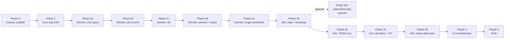

# LifeFinances Rebuild — Plan Index

> **For agentic workers:** Load this index at the start of any implementation session. Load **only** the active phase plan linked below — not the full rebuild. Completed phase plans are reference-only unless explicitly requested.

**Goal:** Execute the greenfield LifeFinances rebuild (Python, TPAW, SQLite, HTMX) as a sequence of small, mergeable PRs.

**Architecture:** See [2026-06-12-life-finances-rebuild-design.md](../specs/2026-06-12-life-finances-rebuild-design.md)

**Agent workspace:** Run from `life-finances-workspace` (LifeFinances + tpaw + legacy) until Phase 3 simulation core is done; then LifeFinances-only is sufficient.

**Tech stack:** uv workspace, FastAPI, Jinja2, HTMX, Pydantic, SQLite, pytest, ruff, pyright, Marimo (tools)

---

## How planning works

| Layer             | File                                                                | When to load                          |
| ----------------- | ------------------------------------------------------------------- | ------------------------------------- |
| Architecture spec | `docs/superpowers/specs/2026-06-12-life-finances-rebuild-design.md` | Reference sections as needed          |
| **This index**    | `docs/superpowers/plans/2026-06-12-rebuild-index.md`                | Every implementation session          |
| Phase plan        | `docs/superpowers/plans/YYYY-MM-DD-phase-N-<name>.md`               | Only while executing that phase       |
| Package OVERVIEW  | `packages/*/OVERVIEW.md`                                            | When touching domain/simulation logic |

**Do not** generate or load a monolithic all-phases plan. Each phase plan is written **on demand** in a fresh session before work starts, using writing-plans skill at phase scope (~1–3 agent sessions of detail).

**Execution:** Subagent-driven development recommended — one subagent per task within a phase plan.

---

## Active phase

| Field             | Value                                                      |
| ----------------- | ---------------------------------------------------------- |
| **Current phase** | Phase 3b — execute                                         |
| **Active plan**   | `2026-06-12-phase-3b-simulation-tpaw-withdrawals.md`        |
| **Next action**   | Execute Phase 3b plan                                       |

When a phase completes: set its plan header to `status: complete`, update this table, and write the next phase plan before coding.

---

## Phase sequence

Phases 2b → 2c → 2d → 2e are sequential (job income before SS before pension/taxes before single-household). Phase 2a must land before 2b. Phases 3a–3d must be sequential. **Phase 3a+ is optional** — live market-data acquisition; does not block Phase 3b.

---

## Phase summary

### Phase 0 — Cutover and scaffold

**Plan file:** `[2026-06-12-phase-0-cutover-scaffold.md](2026-06-12-phase-0-cutover-scaffold.md)`

**PR scope:** Legacy preservation + empty new tree on `main`

| Item              | Detail                                                                                                                                                                         |
| ----------------- | ------------------------------------------------------------------------------------------------------------------------------------------------------------------------------ |
| **Delivers**      | Tag `legacy/v1-final`, `life-finances-legacy` mirror instructions, new uv workspace skeleton, `data.db.blank`, `init_db.py`, root `AGENTS.md`, `.gitignore` for `data/data.db` |
| **Removes**       | Legacy tree (`backend/`, `frontend/`, devcontainer, old docs chains)                                                                                                           |
| **References**    | Current `main` before cutover; design spec §2                                                                                                                                  |
| **Agent context** | Workspace — compare old layout while deleting                                                                                                                                  |

**Entry criteria:** Architecture spec approved and committed.

**Exit criteria:**

- [ ] Tag `legacy/v1-final` exists on pre-cutover commit
- [ ] `life-finances-legacy` repo created (manual GitHub step documented in plan)
- [ ] New workspace layout matches spec §2 (empty packages, scripts, data/)
- [ ] `uv sync` succeeds at workspace root
- [ ] `scripts/init_db.py` creates `data/data.db` from blank
- [ ] Root `AGENTS.md` documents bootstrap, db inspect, artifact policy
- [ ] CI placeholder or minimal pass (new Python-only checks)

---

### Phase 1 — Core loop (minimal E2E)

**Plan file:** `[2026-06-12-phase-1-core-loop.md](2026-06-12-phase-1-core-loop.md)`

**PR scope:** Plan model, SQLite repo, simulation stub, split-pane shell with auto-results

| Item              | Detail                                                                                                                                                                                                                                                                     |
| ----------------- | -------------------------------------------------------------------------------------------------------------------------------------------------------------------------------------------------------------------------------------------------------------------------- |
| **Delivers**      | `packages/core` (`Plan`, repository, default bootstrap), `packages/simulation` (stub), `packages/web` (FastAPI split-pane, HTMX debounced results), **two** editor sections (Household + Current Savings Portfolio). Base spending is simulation output, not a user input. |
| **References**    | [Phase 1 design spec](../specs/2026-06-12-phase-1-core-loop-design.md); architecture spec §3, §4                                                                                                                                                                           |
| **Agent context** | LifeFinances repo                                                                                                                                                                                                                                                          |

**Entry criteria:** Phase 0 complete.

**Exit criteria:**

- [x] `Plan` persists to SQLite via repository
- [x] Empty DB auto-creates "Default Plan" on first visit
- [x] Web serves split-pane at `/` with Household and Current Savings sections
- [x] Editing triggers debounced results panel update
- [x] Simulation stub returns deterministic placeholder data
- [x] pytest passes for core, simulation, and web

---

### Phase 2a — Domain: core types and timed streams

**Plan file:** `[2026-06-12-phase-2a-domain-core.md](2026-06-12-phase-2a-domain-core.md)`

**Delivers:** Unified timed income/spending stream types, plan schema extensions, domain package skeleton.

**References:** Design spec §3, §6 items 17–18; legacy `backend/app/models/config/`

**Entry criteria:** Phase 1 complete.

**Exit criteria:**

- [x] `LabeledAmountTimed` (or equivalent) in `core`/`domain`
- [x] Plan schema includes dated-plan fields, per-person end age (default 100)
- [x] Unit tests for stream serialization and month indexing

---

### Phase 2b — Domain: Job income

**Plan file:** `[2026-06-12-phase-2b-domain-job-income.md](2026-06-12-phase-2b-domain-job-income.md)`

**Delivers:** Port job income module; stream ends at configured date; feeds SS earnings and taxes. Planned sabbaticals (income break or % reduction over a defined window) via stream composition (see Phase 2a design §6.1).

**References:** Legacy `job_income.py`, related tests; Phase 2a design §4 (growth re-anchoring), §6.1 (composition).

**Entry criteria:** Phase 2a complete.

**Exit criteria:**

- [x] Job income as unified timed stream
- [x] Planned sabbaticals: full break and % reduction, composed from segmented streams with correct growth re-anchoring
- [x] No system-level retirement state

---

### Phase 2c — Domain: Social Security

**Plan file:** `[2026-06-12-phase-2c-domain-social-security.md](2026-06-12-phase-2c-domain-social-security.md)`

**Delivers:** Port `social_security.py` with monthly boundaries; auto-generated configurable income streams. Consumes job-income projections for future earnings.

**References:** Legacy `backend/app/models/controllers/social_security.py`, tests in `backend/tests/models/controllers/test_social_security.py`, tpaw for output validation only.

**Entry criteria:** Phase 2b complete.

**Exit criteria:**

- [x] Ported tests pass (adapted to monthly)
- [x] SS projects to unified timed income streams
- [x] SS earnings integration tested (sabbatical-reduced earnings flow through)
- [x] `packages/domain/OVERVIEW.md` documents port status

---

### Phase 2d — Domain: Pension and taxes

**Plan file:** `2026-06-12-phase-2d-domain-pension-taxes.md`

**Delivers:** Job-attached formula DB pension (CalSTRS defaults) + manual streams; income-side taxes; `Household.filing_status` (MFJ/single) honored by tax brackets; `domain.build_monthly_cashflows(plan)` aggregator.

**References:** [Phase 2d design spec](../specs/2026-06-25-phase-2d-domain-pension-taxes-design.md); legacy `pension.py`, `taxes.py`, tests.

**Entry criteria:** Phase 2c complete.

**Exit criteria:**

- [x] Pension formula path + manual stream path
- [x] Income-side tax application on domain cashflows
- [x] `Household.filing_status` selects MFJ vs single brackets
- [x] `domain.build_monthly_cashflows(plan)` API defined and tested

---

### Phase 2e — Domain: single-person household

**Plan file:** `[2026-06-12-phase-2e-domain-single-household.md](2026-06-12-phase-2e-domain-single-household.md)`

**Delivers:** Optional `person2`; auto-wire `filing_status` from household size (MFJ when two people, single when one); adapt job income, SS spousal, pension, and horizon logic for absent partner.

**References:** Phase 2d design spec §10 (deferred items); architecture spec §6 item 10.

**Entry criteria:** Phase 2d complete.

**Exit criteria:**

- [x] `Household.person2` optional (`None` = single-person plan)
- [x] `filing_status` defaults from household size; user override still honored
- [x] Job income, SS, pension, and `build_monthly_cashflows` work with one person
- [x] Spousal SS logic skipped when partner absent
- [x] `packages/domain/OVERVIEW.md` documents single-household support

---

### Phase 3a — Simulation: market data and bootstrap

**Plan file:** `2026-06-12-phase-3a-simulation-market-data.md`

**Delivers:** Port tpaw historical monthly data; block-bootstrap real return paths; scalar inflation (suggested vendored breakeven + manual override).

**References:** `tpaw/packages/simulator-rust/src/lib/historical_monthly_returns/`, design spec §6 items 6–7, 22–23, 27.

**Entry criteria:** Phase 2e complete.

**Exit criteria:**

- [x] tpaw v7 data vendored with attribution (returns CSV + FRED T10YIE)
- [x] Block-bootstrap produces `(num_runs, months_per_run)` monthly log-return paths per asset
- [x] Inflation: scalar suggested (vendored breakeven) + manual override; bootstrapped inflation paths deferred (interface left open, [#186](https://github.com/chriskelly/LifeFinances/issues/186))
- [x] Sampling: tpaw defaults on `Plan` + advanced overrides (UI wiring deferred to Phase 4)

---

### Phase 3a+ — Simulation: networked market data *(optional)*

**Plan file:** `[2026-06-12-phase-3a-plus-networked-market-data.md](2026-06-12-phase-3a-plus-networked-market-data.md)` *(complete)*

**Design spec:** [2026-06-28-phase-3a-plus-networked-market-data-design.md](../specs/2026-06-28-phase-3a-plus-networked-market-data-design.md)

**Delivers:** tpaw parity for suggested inflation via best-effort live FRED `T10YIE` fetch (official JSON API, `FRED_API_KEY` required) with gitignored CSV cache + offline fallback to the vendored CSV; manual refresh CLI with a `--update-vendored` maintainer mode; DB-backed API keys (`AppSettings` singleton) entered via a minimal masked web form. **SP500 / EOD equity data and Treasury bond-yield feed deferred to Phase 3c.** Per-run bootstrapped inflation paths remain tracked separately ([#186](https://github.com/chriskelly/LifeFinances/issues/186)).

**References:** [Phase 3a+ design spec](../specs/2026-06-28-phase-3a-plus-networked-market-data-design.md); [Phase 3a design spec §10](../specs/2026-06-25-phase-3a-simulation-market-data-design.md); tpaw `get_daily_market_data_series_from_source` (`get_inflation`).

**Entry criteria:** Phase 3a complete.

**Exit criteria:**

- [x] Suggested inflation best-effort auto-updates from the FRED JSON API when `allow_refresh` + key present + stale cache; vendored CSV remains the guaranteed fallback
- [x] Refresh is fail-silent and never blocks the simulation; `make test` stays network-free (injected fetcher, never `allow_refresh=True`)
- [x] Manual refresh CLI (`scripts/refresh_market_data.py`) warms the cache loudly; `--update-vendored` rewrites the committed CSV from a full-series fetch
- [x] API keys stored in `AppSettings` (singleton DB row), entered via a minimal masked web form; injected at the web/CLI boundary; never in plan JSON, plan export, git, or CI

**Not blocking:** Phase 3b may proceed without 3a+.

---

### Phase 3b — Simulation: TPAW withdrawal core

**Plan file:** `2026-06-12-phase-3b-simulation-tpaw-withdrawals.md`

**Delivers:** Full TPAW monthly withdrawal engine using fixed/manual planning returns & volatility — risk-tolerance → RRA (age glide + legacy), Merton's formula (stock allocation + spending tilt), backward NPV precompute + amortization, vectorized forward monthly loop with essential/discretionary/general/legacy pool carving, monthly rebalancing, and raw per-run result arrays.

**References:** tpaw simulator-rust/simulator-cuda simulate modules (`process_risk.rs`, `mertons_formula.h`, `run_tpaw.cu`, `run_common.cu`); design spec §6 items 1–4, 14, 18–19, 29; `docs/superpowers/specs/2026-06-29-phase-3b-simulation-tpaw-withdrawals-design.md`.

**Entry criteria:** Phase 3a complete.

**Exit criteria:**

- [x] Full monthly engine: RRA/age-glide, Merton stock allocation, PV precompute, amortized general withdrawal, essential/discretionary/legacy pool carve
- [x] Spending tilt applied to the amortized general-spending schedule
- [x] Withdrawals start at month 0 (retirement implicit in cashflows, no separate accumulation phase)
- [x] `SimulationResult` carries raw per-run arrays (`num_runs × months`), not yet percentile-reduced
- [x] Doctest-golden unit tests pinning math primitives (Merton's formula, RRA conversion, NPV/pool-carve helpers) to tpaw's own published test values

---

### Phase 3c — Simulation: planning-returns presets

**Plan file:** `2026-06-12-phase-3c-simulation-allocation-pv.md` *(to write)*

**Delivers:** Live CAPE/EOD-derived expected-return presets (replacing 3b's fixed/manual planning returns), empirical variance refinement, and a stock-allocation glide path — **with vendored fallback** (CAPE / expected-return path uses current S&P 500 level when available). RRA, Merton's formula, PV of future income, and total-portfolio allocation are already delivered in Phase 3b; 3c only upgrades the *source* of the planning-return inputs those formulas consume.

**References:** tpaw `process_market_data_for_presets`, `get_daily_market_data_series_from_source` (`get_from_eod`); design spec §6 items 4, 20–21, 26.

**Entry criteria:** Phase 3b complete.

**EOD Historical Data (bring-your-own-key):**

tpaw pulls daily EOD prices from [EODHD](https://eodhd.com/) for preset math (`GSPC.INDX`, `VT.US`, `BND.US`). LifeFinances follows the same **BYOK** model as tpaw:

| Principle | Detail |
| --------- | ------ |
| **User-owned key** | Each user enters `EOD_API_KEY` (and `FRED_API_KEY` from 3a+) via the in-app settings form; stored in the `AppSettings` singleton row in the gitignored `data/data.db`. Never committed, never in plan JSON/export, never required in CI. |
| **Vendored fallback** | When the key is absent, the network fails, or rate limits/errors occur → use vendored snapshots (v7 historical CSV / CAPE column, plus any 3c-vendored daily SP500/ETF files). Simulation and presets must remain usable offline. |
| **Caching** | Cache successful live fetches on disk with TTL; avoid hammering the API (tpaw uses ~30-day lookback, 3 symbols per refresh). |
| **Free tier** | EODHD free tier (~20 calls/day) is sufficient for personal use with caching; paid tier (~$20/mo) only if limits are hit in practice. |

**Exit criteria:**

- [ ] CAPE / stock expected-return presets: live `GSPC.INDX` via `EOD_API_KEY` when available; vendored fallback otherwise, replacing 3b's fixed/manual `PlanningReturnsConfig` values
- [ ] Empirical variance refinement for the live preset (vs. 3b's vendored-series variance)
- [ ] Stock-allocation glide path derived from the live preset feed
- [ ] (Optional) Live `VT.US` / `BND.US` daily returns for preset parity; same fallback pattern
- [ ] `EOD_API_KEY` stored in `AppSettings` (reusing the 3a+ settings form/field); no key path tested in CI

*(Stock allocation from RRA on total portfolio and PV of future income from domain cashflows were delivered in Phase 3b — 3c only replaces the planning-return/variance inputs those formulas consume.)*

---

### Phase 3d — Simulation: results data layer

**Plan file:** `2026-06-12-phase-3d-simulation-results.md` *(to write)*

**Delivers:** `SimulationResult` structure covering all tpaw major chart data series; configurable percentiles; dated plan starts from today.

**References:** tpaw `wire_simulate_api.proto`; design spec §6 items 5, 24, 30–31.

**Entry criteria:** Phase 3c complete.

**Exit criteria:**

- [ ] Result types match chart requirements (balance, spending, withdrawals, allocation, …)
- [ ] User-configurable percentile list
- [ ] Per-person end age respected; simulation starts from today

**After Phase 3d:** Agent workspace may shrink to LifeFinances-only for most work.

---

### Phase 4 — UI completeness

**Plan file:** `2026-06-12-phase-4-web-ui.md` *(to write)*

**Delivers:** All editor sections, full tpaw chart set in results panel, multiple named plans, legacy YAML import script.

**References:** Design spec §4, §6 items 24–25, 28.

**Entry criteria:** Phase 3d complete.

**Exit criteria:**

- [ ] Split-pane editor sections for all plan domains
- [ ] All major tpaw chart types rendering
- [ ] Plan create/switch/duplicate
- [ ] `scripts/import_legacy_yaml.py` with documented gaps
- [ ] Investigate generated flat form DTOs from `core.models` (`create_model` + prefixed `model_fields`) if hand-written section forms become unwieldy

*May split into Phase 4a (editor) and Phase 4b (charts) if context requires.*

---

### Phase 5 — Tools

**Plan file:** `2026-06-12-phase-5-tools-disability-insurance.md` *(to write)*

**Delivers:** Marimo disability insurance calculator using shared packages.

**References:** Legacy `standalone_tools/disability_insurance_calculator.ipynb`, design spec §5.

**Entry criteria:** Phase 4 usable for plan editing and simulation.

**Exit criteria:**

- [ ] `tools/disability_insurance.py` runs via `uv run marimo edit …`
- [ ] Uses `domain` + `simulation`; no `web` import
- [ ] `tools/AGENTS.md` documents adding new tools

---

## Cross-cutting tasks (woven into phases)

| Task                                               | Phase                          |
| -------------------------------------------------- | ------------------------------ |
| Legacy YAML import                                 | 4                              |
| `import_legacy_yaml.py`                            | 4                              |
| `packages/simulation/OVERVIEW.md` parity checklist | 3b onward, updated per feature |
| `FRED_API_KEY` / `EOD_API_KEY` via `AppSettings` DB row + settings form | 3a+ / 3c |
| Pre-commit / CI for Python-only monorepo           | 0–1                            |
| Remove/archive old `docs/features/` to `archive/`  | 0                              |

---

## PR sizing guidance

- Target **one phase = one PR** where feasible
- Split a phase into 2 PRs if estimated diff > ~2000 lines or > ~40k tokens of plan detail
- Each PR must leave `main` in a working state (tests pass, app runs)

---

## Context budget guidance

| Session type    | Load                                                              |
| --------------- | ----------------------------------------------------------------- |
| Index review    | This file only (~4k tokens)                                       |
| Phase planning  | Index + spec relevant sections + tpaw/legacy files for that phase |
| Phase execution | Index + active phase plan + files for current task                |
| Avoid           | Full spec + all phase plans + tpaw repo in one context            |

---

## Completed plans

| Phase    | Plan file                                       | Status   |
| -------- | ----------------------------------------------- | -------- |
| Phase 0  | `2026-06-12-phase-0-cutover-scaffold.md`        | complete |
| Phase 1  | `2026-06-12-phase-1-core-loop.md`               | complete |
| Phase 2a | `2026-06-12-phase-2a-domain-core.md`            | complete |
| Phase 2b | `2026-06-12-phase-2b-domain-job-income.md`      | complete |
| Phase 2c | `2026-06-12-phase-2c-domain-social-security.md` | complete |
| Phase 2d | `2026-06-12-phase-2d-domain-pension-taxes.md` | complete |
| Phase 2e | `2026-06-12-phase-2e-domain-single-household.md` | complete |
| Phase 3a | `2026-06-12-phase-3a-simulation-market-data.md` | complete |

---

## Next step

Write **Phase 3b plan** before coding. Phase 3a+ (networked market data) is optional and may run in parallel or after 3b.